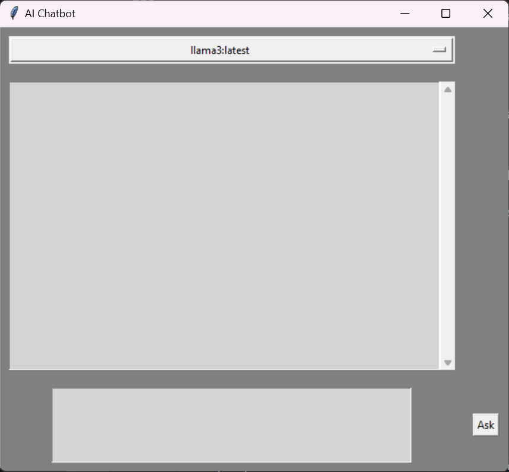

# AI Chatbot with Ollama and LangChain in a Tkinter GUI

This project is a simple AI chatbot built with a Python Tkinter-based GUI. The chatbot integrates **Ollama** for language model interaction via **LangChain**. Users can input questions, and the AI will respond accordingly. The project includes model selection and handles multi-line text input with a `Text` widget in Tkinter.

---

## Table of Contents

- [Project Overview](#project-overview)
- [Requirements](#requirements)
- [Project Setup](#project-setup)
  - [Create a Virtual Environment](#create-a-virtual-environment)
  - [Activate the Virtual Environment](#activate-the-virtual-environment)
- [Install Dependencies](#install-dependencies)
- [Ollama Setup](#ollama-setup)
  - [Install Ollama](#install-ollama)
  - [Download and Select Models](#download-and-select-models)
- [Running the Project](#running-the-project)
- [Contributing](#contributing)
- [License](#license)

---

## Project Overview

This chatbot interacts with an AI model (via **Ollama**) in a **Tkinter** GUI. Users can ask questions in a multi-line text box, and the responses are displayed in a conversational format, with different colors for user and AI messages. You can switch between AI models provided by Ollama.

---

## Requirements

- Python 3.8 or higher
- Virtual Environment (recommended)
- Dependencies:
  - Tkinter (GUI)
  - LangChain
  - Ollama

---

## Project Setup

### Create a Virtual Environment

It is recommended to run the project in a virtual environment to isolate dependencies.

1. **Open a terminal** in the project directory.
2. Run the following command to create a virtual environment:

```bash
python -m venv venv
```
This creates a virtual environment named venv.

Activate the Virtual Environment
To activate the virtual environment, the steps differ depending on the terminal you're using:

Windows (Command Prompt or PowerShell)

- Command Prompt:
```bash
venv\Scripts\activate
```
- PowerShell
```bash
.\venv\Scripts\Activate
```
- macOS / Linux
```bash
source venv/bin/activate
```
- Windows (Git Bash)
```bash
source venv/Scripts/activate
```
- macOS / Linux
```bash
source venv/bin/activate
```

Once the virtual environment is activated, you should see (venv) in your terminal prompt.

---

## Ollama Setup

### Install Ollama

1. Install Ollama on your machine following the instructions provided on the [Ollama website](https://python.langchain.com/docs/integrations/llms/ollama/). Ollama provides a local instance for interacting with large language models.
```bash
pip install -U langchain-ollama
```
2. Once installed, ensure it’s running properly by executing:

```bash
ollama --version
```
You should see the version number if it's installed correctly.

### Download and Select Models

To use a model in this chatbot, you'll need to download it using ollama pull and then use the model in the chatbot.

1. Download a model via ollama pull. For example, to download llama3, run:
```bash
ollama pull llama3
```
2. List available models to verify your download:
```bash
ollama list
```
This will show all available models. You can use these models in the chatbot.

---

### Running the Project
To start the chatbot:

1. Ensure the virtual environment is activated (see the Activate the Virtual Environment section).
Run the Python script:
```bash
python main.py
```
This will open the Tkinter GUI where you can:

> - Select the AI model from the dropdown.
> - Type your question in the text box (supports multiline input).
> - Submit the question by pressing Ctrl + Enter or by clicking the "Ask" button.
> - The response will appear in the conversation window, with user input in blue and AI responses in green.

---

### Contributing

Feel free to contribute to this project by submitting issues, creating pull requests, or suggesting features.

---

### License
This project is licensed under the MIT License. 

